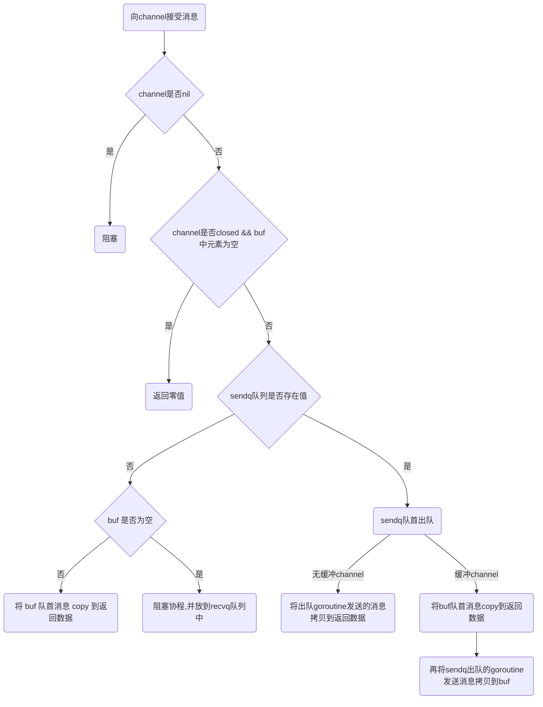

## channel

```bash
graph LR
    1(channel) --> 2(向 channel 发送消息)
    1 --> 3(接受消息)
    1 --> 4(关闭channel)
    2 -- full channel--> 5(阻塞)
    2 --closed channel--> 6(panic)
    3 --empty channel-->5
    3 --closed channel--> 7(读到零值)
    4 --closed/nil channel--> 6
```

```
 graph TB
    1(向 channel 发送消息) --> 2{channel 是否 nil} --否--> 4{channel 是否 closed}--否--> 6{recvq 队列是否存在值}--否-->8{buf 是否未满} --否--> 10(阻塞协程,并放到 sendq 队列中)
2 --是--> 3(阻塞)
    4  --是--> 5(panic)
    6 --是--> 7(队首出队,消息直接发送至该 goroutine 中)
    8--是--> 9(消息拷贝到 buf sendx位置中,等待唤醒)
```


