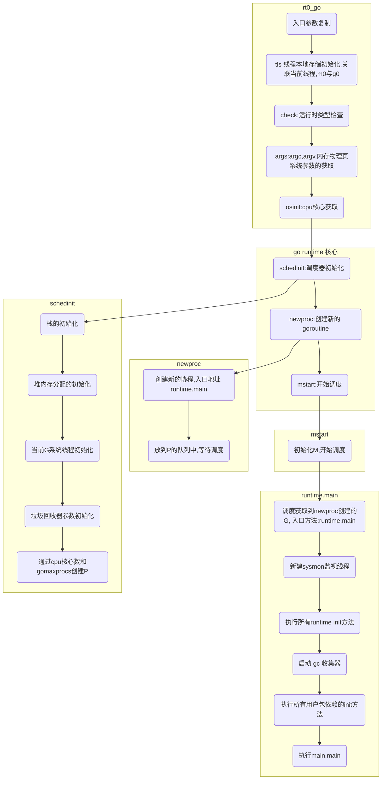

---

title: "Golang 程序启动过程"
author: "小贺"
date: 2021-11-26T17:10:12+08:00
tags: ["golang"]

---

> `go run main.go` 一个 Go 程序就启动了。然而这背后操作系统如何执行到 Go 代码的，Go 为了运行用户 main 函数，又做了什么？

## 一 编译

- `go build main.go`

我们写的 go 代码都是编译成可执行文件去机器上直接执行的，在 linux 平台上是 [ELF](https://zhuanlan.zhihu.com/p/286088470) 格式的可执行文件，linux 能直接执行这个文件。

- 编译器：将 go 代码生成 .s 汇编代码，go 中使用的是 plan9 汇编
- 汇编起：将汇编代码转成机器代码，即目标程序 .o 文件
- 链接器：将多个 .o 文件合并链接得到最终可执行文件


## 二 操作系统加载

- `./main`

经上述几个步骤生成可执行文件后，二进制文件在被操作系统加载起来运行时会经过如下几个阶段：

1. 从磁盘上把可执行程序读入内存；
2. 创建进程和主线程；
3. 为主线程分配栈空间；
4. 把由用户在命令行输入的参数拷贝到主线程的栈；
5. 把主线程放入操作系统的运行队列等待被调度执起来运行；

`START_THREAD(elf_ex, regs, elf_entry, bprm->p)` 启动线程传入了 `elf_entry` 参数，这是程序的入口地址。

这个 `elf_entry` 被写在 elf 可执行文件的 header 中

```bash
$ readelf -h main
ELF Header:
  Magic:   7f 45 4c 46 02 01 01 00 00 00 00 00 00 00 00 00
  Class:                             ELF64
  Data:                              2's complement, little endian
  Version:                           1 (current)
  OS/ABI:                            UNIX - System V
  ABI Version:                       0
  Type:                              EXEC (Executable file)
  Machine:                           Advanced Micro Devices X86-64
  Version:                           0x1
  Entry point address:               0x45d430
  Start of program headers:          64 (bytes into file)
  Start of section headers:          456 (bytes into file)
  Flags:                             0x0
  Size of this header:               64 (bytes)
  Size of program headers:           56 (bytes)
  Number of program headers:         7
  Size of section headers:           64 (bytes)
  Number of section headers:         25
  Section header string table index: 3
```

并且通过反编译 可执行文件，可以看到这个地址对应的就是 _rt0_amd64_linux。

```bash
$ objdump ./main -D > tmp
$ grep tmp '45d430'
000000000045d430 <_rt0_amd64_linux>:
  45d430:    e9 2b c4 ff ff           jmpq   459860 <_rt0_amd64>
```

从此进入了 Go 程序的启动过程

## Go 程序启动

Go 程序[启动位置](https://github.com/golang/go/blob/5786a54cfe34069c865fead1b6d9c9e3485a40a5/src/runtime/asm_amd64.s#L15), 把栈上的入口参数存到寄存器中，接下来跳转到 `rt0_go` 启动函数

```bash
TEXT _rt0_amd64(SB),NOSPLIT,$-8
    MOVQ    0(SP), DI    // argc
    LEAQ    8(SP), SI    // argv
    JMP    runtime·rt0_go(SB)
```

`rt0_go` 代码比较长，可分为两个部分，第一部分是系统参数获取和运行时检查。第二部分是 go 程序启动的核心，这里只详细介绍第二部分，总体启动流程如下




go runtime 核心：

1. `schedinit`：进行各种运行时组件初始化工作，这包括我们的调度器与内存分配器、回收器的初始化
2. `newproc`：负责根据主 goroutine（即 main）入口地址创建可被运行时调度的执行单元，这里的main还不是用户的main函数，是`runtime.main`
3. `mstart`：开始启动调度器的调度循环, 执行队列中 入口方法是`runtime.main` 的 G

```c
TEXT runtime·rt0_go(SB),NOSPLIT,$0
    (...)
    // 调度器初始化
    CALL    runtime·schedinit(SB)

    // 创建一个新的 goroutine 来启动程序
    MOVQ    $runtime·mainPC(SB), AX
    PUSHQ    AX
    PUSHQ    $0            // 参数大小
    CALL    runtime·newproc(SB)
    POPQ    AX
    POPQ    AX

    // 启动这个 M，mstart 应该永不返回
    CALL    runtime·mstart(SB)
    (...)
    RET
```

`shedinit`包括了所有核心组件的初始化工作

```go
// src/runtime/proc.go
func schedinit() {
    _g_ := getg()
    (...)

    // 栈、内存分配器、调度器相关初始化
    sched.maxmcount = 10000    // 限制最大系统线程数量
    stackinit()            // 初始化执行栈
    mallocinit()        // 初始化内存分配器
    mcommoninit(_g_.m)    // 初始化当前系统线程
    (...)

    gcinit()    // 垃圾回收器初始化
    (...)

    // 创建 P
    // 通过 CPU 核心数和 GOMAXPROCS 环境变量确定 P 的数量
    procs := ncpu
    if n, ok := atoi32(gogetenv("GOMAXPROCS")); ok && n > 0 {
        procs = n
    }
    procresize(procs)
    (...)
}
```

执行 `runtime.main`,  主要进行了

1. 启动系统后台监控sysmon 线程
2. 执行 runtime 包内 init
3. 启动gc
4. 用户包依赖 init 的执行
5. 执行用户main.mian 方法

```go
// The main goroutine.
func main() {
    g := getg()

    ...
    // 执行栈最大限制：1GB（64位系统）或者 250MB（32位系统）
    if sys.PtrSize == 8 {
        maxstacksize = 1000000000
    } else {
        maxstacksize = 250000000
    }
    ...

    // 启动系统后台监控（定期垃圾回收、抢占调度等等）
    systemstack(func() {
        newm(sysmon, nil)
    })

    ...
    // 让goroute独占当前线程， 
    // runtime.lockOSThread的用法详见http://xiaorui.cc/archives/5320
    lockOSThread()

    ...
    // runtime包内部的init函数执行
    runtime_init() // must be before defer

    // Defer unlock so that runtime.Goexit during init does the unlock too.
    needUnlock := true
    defer func() {
        if needUnlock {
                unlockOSThread()
        }
    }()
    // 启动GC
    gcenable()

    ...
    // 用户包的init执行
    main_init()
    ...

    needUnlock = false
    unlockOSThread()

    ...
    // 执行用户的main主函数
    main_main()

    ...
    // 退出
    exit(0)
    for {
        var x *int32
        *x = 0
    }
}
```

## 总结

启动一个 Go 程序时，首先要经过操作系统的加载，通过可执行文件中 `Entry point address` 记录的地址，找到 go 程序启动入口: `_rt0_amd64` ->  `rt0_go`。`rt0_go` 中 先进行了 go 程序的 runtime 的初始化，其中包括:调度器，栈，堆内存空间初始化，垃圾回收器的初始化，最后最后通过 `newproc`和 `mstart`调度执行 `runtime.main`,完成一系列初始化过程，再然后才是执行用户的主函数。

## 参考

1. https://www.bookstack.cn/read/qcrao-Go-Questions/%E7%BC%96%E8%AF%91%E5%92%8C%E9%93%BE%E6%8E%A5-Go%20%E7%A8%8B%E5%BA%8F%E5%90%AF%E5%8A%A8%E8%BF%87%E7%A8%8B%E6%98%AF%E6%80%8E%E6%A0%B7%E7%9A%84.md
2. https://eddycjy.com/posts/go/go-bootstrap0/
3. https://loulan.me/post/golang-boot/
4. https://juejin.cn/post/6942509882281033764
